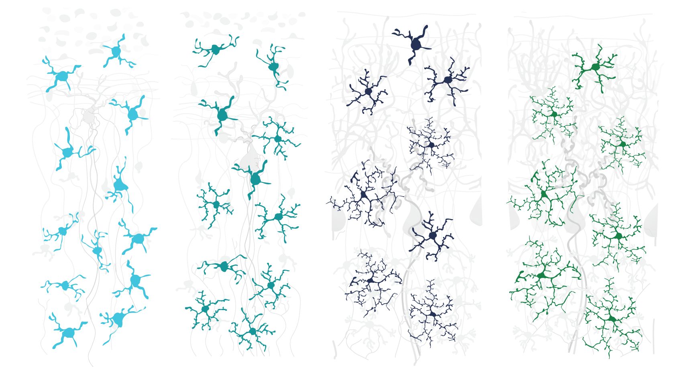

I recently finished my PhD in Neuroscience under the supervision of Prof. João Peça at University of Coimbra and am now in search for new opportunities outside strict academia.
I am incredibly passionate about science and how it can drive positive change! 
Detail-oriented and capable of managing mutidisciplinary teams. Extemely fast learner and proactive. 
Experienced in programming with multiple languages as well as data analysis, statistics and visualization tools in the
context of life sciences. Tech enthusiast and tinkerer with a love for developing tools to improve research|

Here you can find some of the illustrations I created throughout my PhD, either for research and review articles or SciComm activities!

<h3 align="center"><a href="https://pedroacferreira.github.io/portfolio"> Check my portfolio here! </a></h3>

    

       
    

